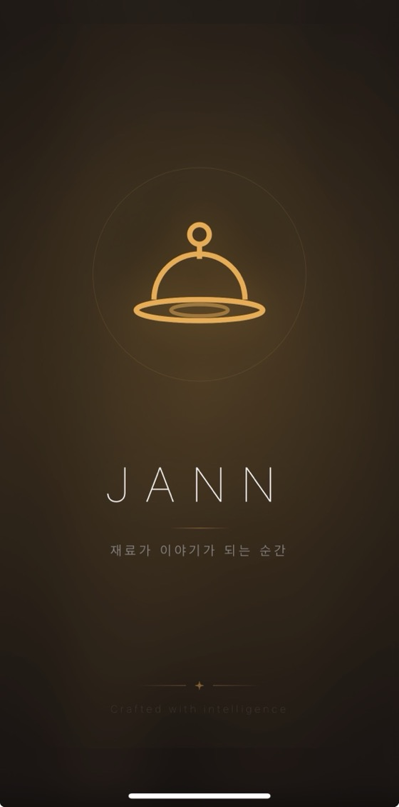

# 김희태 포트폴리오 — 제작 가이드라인

**Version:** 1.0  
**Last Updated:** 2026-04-27  
**Author:** 김희태  

---

## 1. 프로젝트 구조

```
김희태_포트폴리오01/
├── index.html              ← 포트폴리오 허브 (메인)
├── JANN.html               ← 프로젝트 슬라이드 덱 (iOS)
├── LHV.html                ← 프로젝트 슬라이드 덱 (제조 AI)
├── Skinpass.html            ← 프로젝트 슬라이드 덱 (SCM)
├── shared/
│   ├── tokens.css           ← 디자인 시스템 (색상, 타이포, 간격)
│   ├── deck-stage.js        ← 슬라이드 엔진 (Web Component)
│   └── fonts/               ← 로컬 폰트 파일
│       ├── PlusJakartaSans.ttf
│       ├── PlusJakartaSans-Italic.ttf
│       ├── SpaceMono-Regular.ttf
│       ├── SpaceMono-Bold.ttf
│       ├── SpaceMono-Italic.ttf
│       └── SpaceMono-BoldItalic.ttf
├── jann/img/                ← JANN 프로젝트 이미지 에셋
├── uploads/                 ← 원본 자료 (마크다운, 스크린샷 등)
└── .vscode/launch.json
```

---

## 2. 디자인 시스템 (`tokens.css`)

### 2.1 컬러 팔레트

| 토큰            | 값         | 용도                    |
|----------------|-----------|------------------------|
| `--paper-50`   | `#FFFFFF` | 배경 (라이트)            |
| `--paper-100`  | `#F7F7F8` | 배경 (소프트)            |
| `--paper-200`  | `#EFEFF1` | 배경 (뮤트)             |
| `--ink-900`    | `#0E0E10` | 본문 텍스트 / 다크 배경    |
| `--ink-700`    | `#2F2F33` | 보조 텍스트              |
| `--ink-500`    | `#6B6B72` | 메타데이터 / 레이블       |
| `--accent-600` | `#1E3A8A` | 강조 (파란색, 수치 하이라이트) |
| `--positive`   | `#4F7A3D` | 긍정 상태               |
| `--warn`       | `#B58A1F` | 경고 상태               |
| `--danger`     | `#B5331E` | 위험 / 기각             |

#### 다크 테마 (`[data-theme="dark"]`)
- 배경: `#0B0B0D`
- 본문: `#F4F4F6`
- 보조 텍스트: `#C2C2C8`

#### JANN 프로젝트 전용 컬러
| 토큰               | 값                         | 용도          |
|-------------------|---------------------------|--------------|
| `--jann-bg-1`     | `#1a120a`                 | 로스팅된 검정   |
| `--jann-amber-1`  | `#f5b556`                 | 앰버 강조      |
| `--jann-text-1`   | `#f4ead8`                 | 크림 화이트    |

### 2.2 타이포그래피

| 역할    | 폰트 패밀리             | CSS 변수        |
|--------|----------------------|----------------|
| 본문    | Plus Jakarta Sans    | `--font-sans`  |
| 코드/숫자 | Space Mono           | `--font-mono`  |

#### 타입 스케일 (모듈러 1.25)

| 토큰        | 크기    | 용도                |
|-----------|-------|-------------------|
| `--fs-xs` | 12px  | 캡션, 메타 레이블      |
| `--fs-sm` | 14px  | 작은 본문            |
| `--fs-base`| 16px | 기본 본문            |
| `--fs-lg` | 22px  | 소제목 (h4)          |
| `--fs-xl` | 28px  | 제목 (h3)           |
| `--fs-2xl`| 36px  | 큰 제목 (h2)         |
| `--fs-3xl`| 48px  | 섹션 타이틀           |
| `--fs-5xl`| 88px  | 히어로 타이틀          |
| `--fs-6xl`| 120px | 슬라이드 디스플레이 타이틀 |

### 2.3 간격 시스템 (4px 기본 단위)

```
--s-1: 4px    --s-5: 24px   --s-9: 96px
--s-2: 8px    --s-6: 32px   --s-10: 128px
--s-3: 12px   --s-7: 48px   --s-11: 192px
--s-4: 16px   --s-8: 64px
```

### 2.4 그 외 토큰
- **테두리:** `--rule` (hairline 1px), `--rule-soft` (14% 투명도)
- **그림자:** `--shadow-1` (미세), `--shadow-2` (보통), `--shadow-3` (강조)
- **모션:** `--ease-out`, `--dur-fast` (140ms), `--dur-base` (220ms)
- **레이아웃:** `--container: 1280px`

---

## 3. 페이지 유형

### 3.1 허브 페이지 (`index.html`)

스크롤 기반 단일 페이지. 모든 프로젝트를 카드 그리드로 보여주는 진입점.

**구조:**
```
topbar ([ HK ] — PORTFOLIO · 2026)
├── hero (타이틀 + 소개문)
├── projects (카드 그리드, auto-fill 360px)
└── footer (이름 — 연도)
```

**카드 구성:**
- `.thumb` — 220px 높이, 프로젝트 대표 이미지 또는 핵심 수치
- `.info` — 번호, 제목, 설명, 기술 태그
- hover 시 테두리 + 그림자 전환

### 3.2 프로젝트 슬라이드 덱 (JANN, LHV, Skinpass)

`<deck-stage>` 웹 컴포넌트 기반 풀스크린 슬라이드.

**디자인 캔버스:** 1920 × 1080px  
**네비게이션:** ← → 키, 클릭, 터치  
**프린트:** `@media print`로 슬라이드별 페이지 분리

#### 표준 6-슬라이드 구조

| 슬라이드 | 유형        | 내용                       |
|---------|-----------|--------------------------|
| 01      | Title     | 프로젝트명, 한 줄 소개, 메타 그리드  |
| 02      | Problem   | 문제 정의 + 핵심 수치 또는 맥락     |
| 03      | Solution  | 핵심 산출물 (스크린샷 / 차트 / 구조도) |
| 04      | Method    | 비교 테이블 또는 가설 카드         |
| 05      | Results   | 모델 성능 / SHAP / 디자인 시스템  |
| 06      | Close     | 회고 + 다음 단계 + 어트리뷰션      |

#### 슬라이드 CSS 클래스

| 클래스          | 배경                   | 용도         |
|---------------|----------------------|------------|
| `.slide`      | `var(--bg)` (화이트)    | 기본         |
| `.slide.dark` | `var(--ink-900)` (블랙) | 클로징, 강조   |
| `.slide.soft` | `var(--paper-100)`    | 가설 카드 등   |
| `.slide.jann-dark` | 커스텀 그라디언트      | JANN 전용    |

#### 공통 슬라이드 요소

```css
/* 상단 룰 */
.top-rule — flex, space-between, mono 26px, uppercase
  좌: "§ 02 · PROBLEM"
  우: "WHY THIS MATTERS"

/* 페이지 번호 */
.pageno-mark — 좌하단 "[ HK ]"
.pageno      — 우하단 "03 / 06"

/* 타이틀 */
h1.slide-title — sans 84px, weight 600, tracking -0.025em
h2.slide-h2    — sans 64px, weight 600, tracking -0.02em
p.slide-body   — sans 32px, line-height 1.6
```

---

## 4. 컴포넌트 패턴

### 4.1 메타 그리드 (타이틀 슬라이드)

```html
<div class="meta-grid">  <!-- grid: repeat(4-5, 1fr) -->
  <div class="col">
    <div class="k">YEAR</div>     <!-- mono 24px, uppercase, fg-3 -->
    <div class="v">2026.03</div>   <!-- sans 28px, fg-1 -->
  </div>
  ...
</div>
```

### 4.2 비교 테이블

```html
<table class="cmp">  <!-- or .slide-table -->
  <thead>
    <tr><th class="col-a">관점</th><th>기존</th><th>OURS <span class="pill">OURS</span></th></tr>
  </thead>
  <tbody>
    <tr class="ours"><td>...</td><td>...</td><td>...</td></tr>  <!-- 하이라이트 행 -->
  </tbody>
</table>
```

### 4.3 통계 블록

```html
<div class="stats-row">  <!-- grid: repeat(4, 1fr) -->
  <div class="stat">
    <div class="k">SCREENS</div>   <!-- mono, uppercase -->
    <div class="v">14</div>         <!-- mono 96px, bold -->
    <div class="u">designed in figma</div>
  </div>
</div>
```

### 4.4 가설 카드

```html
<div class="hyp-grid">  <!-- grid: repeat(4, 1fr) -->
  <div class="hyp-card accept">  <!-- or .reject, .partial -->
    <div class="tag">H1 · 재질등급</div>
    <div class="q">질문?</div>
    <div class="verdict">✓ 채택</div>
  </div>
</div>
```

### 4.5 iPhone 갤러리 (JANN)

```html
<div class="gallery-row">
  <div class="device-wrap">
    <div class="iphone">
      <div class="screen"></div>
    </div>
    <div class="cap">
      <div class="cap-ko">스플래시</div>
      <div>SPLASH · BRAND</div>
    </div>
  </div>
</div>
```

- iPhone 프레임: 280px 너비, border-radius 36px, 검정 배경 + 6px 패딩
- 스크린: border-radius 30px, overflow hidden
- 이미지: `object-fit: cover`로 실제 스크린샷 사용

### 4.6 플로팅 홈 버튼

모든 슬라이드 덱에 포함. 마우스 움직임 시 2.4초간 표시 후 페이드아웃.

```html
<a href="index.html" id="home-btn">← PORTFOLIO</a>
```
- `position: fixed; top: 22px; left: 22px; z-index: 2147483001`
- `background: rgba(0,0,0,0.7); backdrop-filter: blur(8px)`
- `border-radius: 999px`

---

## 5. 새 프로젝트 추가 절차

### Step 1: 콘텐츠 준비
- `uploads/` 폴더에 원본 자료 배치 (마크다운, 이미지, docx)
- 프로젝트별 이미지 폴더 생성: `{project}/img/`

### Step 2: 슬라이드 덱 생성
1. 기존 덱 파일 복사 (LHV.html 권장 — 가장 표준적 구조)
2. 6-슬라이드 구조에 맞춰 콘텐츠 교체
3. `<deck-stage>` 안에 `<section class="slide">` 6개 배치
4. 슬라이드 번호 (`data-label`, `.pageno`) 업데이트
5. 프로젝트 번호 업데이트 (`№ 04 / 05` 등)
6. 플로팅 홈 버튼 포함 확인

### Step 3: 허브 업데이트
- `index.html`의 `.projects` 그리드에 카드 추가
- 프로젝트 번호 순서 정리

### Step 4: 검증
- [ ] 모든 슬라이드 6장 ← → 키 네비게이션 확인
- [ ] 플로팅 홈 버튼 → index.html 이동 확인
- [ ] index.html 카드 클릭 → 각 덱 이동 확인
- [ ] 이미지 잘림 없음 확인
- [ ] `@media print` PDF 출력 확인

---

## 6. 코드 작성 규칙

### 6.1 HTML
- 시맨틱 태그 사용: `<section>`, `<header>`, `<footer>`
- 슬라이드 내부는 인라인 스타일 허용 (각 슬라이드가 독립적 디자인)
- 모든 이미지에 `alt` 속성 필수

### 6.2 CSS
- 디자인 토큰 (`var(--...)`) 우선 사용
- 하드코딩 색상은 프로젝트 전용 컬러만 허용 (JANN 앰버 등)
- 반응형은 `deck-stage`의 auto-scaling에 위임 (슬라이드 내부는 고정 레이아웃)
- index.html만 반응형 그리드 사용: `auto-fill, minmax(360px, 1fr)`

### 6.3 JS
- `deck-stage.js`는 수정하지 않음 (공용 엔진)
- 프로젝트별 스크립트는 `{project}/` 폴더에 배치
- 인터랙션은 최소화 — 슬라이드는 정적 프레젠테이션

### 6.4 이미지
- 원본 스크린샷 사용 우선 (JS 렌더링 지양)
- iPhone 프레임은 CSS로 구현, 스크린 내부만 `` 사용
- 파일명: 영문 소문자 + 하이픈 (`splash.jpg`, `home.png`)

---

## 7. 타이포그래피 사용 원칙

### Paper & Ink 철학
> 포트폴리오의 시각적 뼈대는 **인쇄물의 정밀함**에서 온다.
> 흰 종이(Paper) 위의 검은 잉크(Ink) — 그 사이에 구조와 위계가 만들어진다.

### 폰트 사용 규칙

| 상황              | 폰트          | 무게  | 크기        |
|-----------------|-------------|-----|-----------|
| 슬라이드 메인 타이틀  | Jakarta Sans | 600 | 84-120px  |
| 슬라이드 서브 타이틀  | Jakarta Sans | 600 | 56-64px   |
| 슬라이드 본문       | Jakarta Sans | 400 | 28-32px   |
| 메타 레이블 / 번호  | Space Mono   | 400 | 22-26px   |
| 핵심 수치 (디스플레이) | Space Mono   | 700 | 96-240px  |
| 캡션 / 태그       | Space Mono   | 400 | 18-24px   |

### 한글 + 영문 혼합
- 타이틀: 한글 (Jakarta Sans가 한글 지원하지 않으면 시스템 폰트 fallback)
- 메타/레이블: 영문 대문자 (Space Mono, `text-transform: uppercase`)
- 수치: 영문 + 단위는 Space Mono (`font-feature-settings: "tnum"`)

---

## 8. 컬러 사용 원칙

### 기본 원칙
- **Paper 위의 Ink**: 배경은 항상 Paper 계열, 텍스트는 Ink 계열
- **Accent는 한 번에 하나**: 한 슬라이드에서 강조 색상은 1개만
- **다크 슬라이드**: 오프닝/클로징에만 사용 (중간에 넣지 않음 — Skinpass의 soft 슬라이드 제외)

### 프로젝트별 강조색
| 프로젝트    | 강조색          | 용도            |
|----------|--------------|---------------|
| 공통       | `#1E3A8A`    | accent-600    |
| JANN     | `#F5B556`    | 앰버 (앱 UI 색상)  |
| LHV      | `#1E3A8A`    | accent (기본)    |
| Skinpass | `#1E3A8A`    | accent (기본)    |

---

## 9. 반응형 & 접근성

### 반응형
- **슬라이드 덱**: `deck-stage`가 `transform: scale()`로 뷰포트에 맞춤. 내부 CSS는 1920×1080 고정
- **허브 페이지**: CSS Grid `auto-fill`로 카드 리플로우. 모바일에서 1열

### 접근성
- 슬라이드 키보드 네비게이션: ←→, PgUp/PgDn, Home/End, 숫자 키
- 홈 버튼: `<a>` 태그로 접근 가능
- 이미지 `alt` 텍스트 필수
- 프린트 스타일시트 내장 (PDF 저장 가능)

---

## 10. 파일 네이밍 규칙

| 유형        | 규칙                    | 예시              |
|-----------|----------------------|-----------------|
| HTML 페이지 | PascalCase 또는 영문     | `JANN.html`     |
| CSS/JS    | kebab-case            | `deck-stage.js` |
| 이미지      | kebab-case, 영문 소문자   | `splash.jpg`    |
| 마크다운     | kebab-case            | `design-spec.md`|
| 프로젝트 폴더 | 소문자                  | `jann/`, `shared/` |
